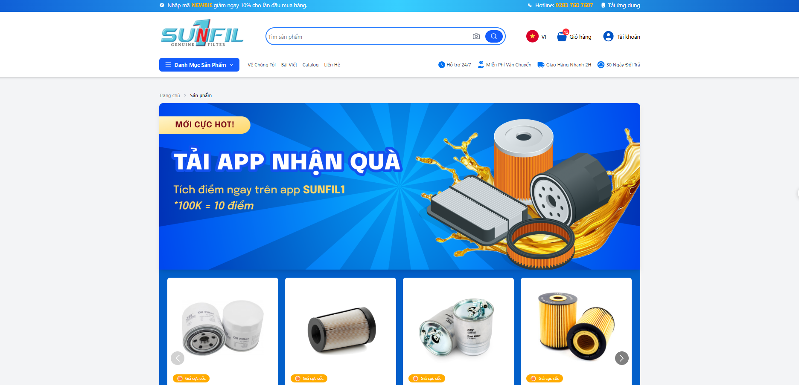

# React + TypeScript + Vite

# 🛍️ Product Catalog

A modern and responsive product catalog web application built with **React**, **TypeScript**, **Vite**, and **Tailwind CSS**. This project demonstrates clean UI, component structure, and a scalable frontend architecture for e-commerce platforms.



---

## 🚀 Features

- ⚡ **Fast & lightweight** setup using Vite
- 🎨 **Responsive UI** built with Tailwind CSS
- 🔎 Product browsing with clean layout and filters
- ✅ Built with **TypeScript** for type safety
- ♻️ Reusable and modular React components
- 🧱 Scalable folder structure for future growth

---

## 🏗️ Tech Stack

| Technology     | Purpose                          |
|----------------|----------------------------------|
| React          | UI development                   |
| TypeScript     | Type checking and developer tools|
| Vite           | Frontend build tool              |
| Tailwind CSS   | Styling                          |
| ESLint + Prettier | Code linting and formatting    |

---

## 📦 Installation

Clone the repository:

```bash
git clone https://github.com/VQuocDinh/product-catalog.git
cd product-catalog


This template provides a minimal setup to get React working in Vite with HMR and some ESLint rules.

Currently, two official plugins are available:

- [@vitejs/plugin-react](https://github.com/vitejs/vite-plugin-react/blob/main/packages/plugin-react) uses [Babel](https://babeljs.io/) for Fast Refresh
- [@vitejs/plugin-react-swc](https://github.com/vitejs/vite-plugin-react/blob/main/packages/plugin-react-swc) uses [SWC](https://swc.rs/) for Fast Refresh

## Expanding the ESLint configuration

If you are developing a production application, we recommend updating the configuration to enable type-aware lint rules:

```js
export default tseslint.config({
  extends: [
    // Remove ...tseslint.configs.recommended and replace with this
    ...tseslint.configs.recommendedTypeChecked,
    // Alternatively, use this for stricter rules
    ...tseslint.configs.strictTypeChecked,
    // Optionally, add this for stylistic rules
    ...tseslint.configs.stylisticTypeChecked,
  ],
  languageOptions: {
    // other options...
    parserOptions: {
      project: ['./tsconfig.node.json', './tsconfig.app.json'],
      tsconfigRootDir: import.meta.dirname,
    },
  },
})
```

You can also install [eslint-plugin-react-x](https://github.com/Rel1cx/eslint-react/tree/main/packages/plugins/eslint-plugin-react-x) and [eslint-plugin-react-dom](https://github.com/Rel1cx/eslint-react/tree/main/packages/plugins/eslint-plugin-react-dom) for React-specific lint rules:

```js
// eslint.config.js
import reactX from 'eslint-plugin-react-x'
import reactDom from 'eslint-plugin-react-dom'

export default tseslint.config({
  plugins: {
    // Add the react-x and react-dom plugins
    'react-x': reactX,
    'react-dom': reactDom,
  },
  rules: {
    // other rules...
    // Enable its recommended typescript rules
    ...reactX.configs['recommended-typescript'].rules,
    ...reactDom.configs.recommended.rules,
  },
})
```
Install dependencies:
npm install

Start development server:
npm run dev

Build for production:
npm run build

Preview production build:
npm run preview

📁 Project Structure
product-catalog/
├── public/              # Static assets
├── src/
│   ├── assets/          # Image & static resources
│   ├── components/      # Reusable React components
│   ├── pages/           # Page-level components
│   ├── App.tsx          # Root component
│   └── main.tsx         # Entry point
├── tailwind.config.ts   # Tailwind configuration
├── vite.config.ts       # Vite configuration
└── README.md

🧪 To Do / Future Improvements
 Add product filtering and sorting

 Integrate with real product API

 Add product detail page

 Add unit tests with Jest / React Testing Library

 Deploy on Vercel or Netlify

👨‍💻 Author
VQuocDinh
📫 GitHub


